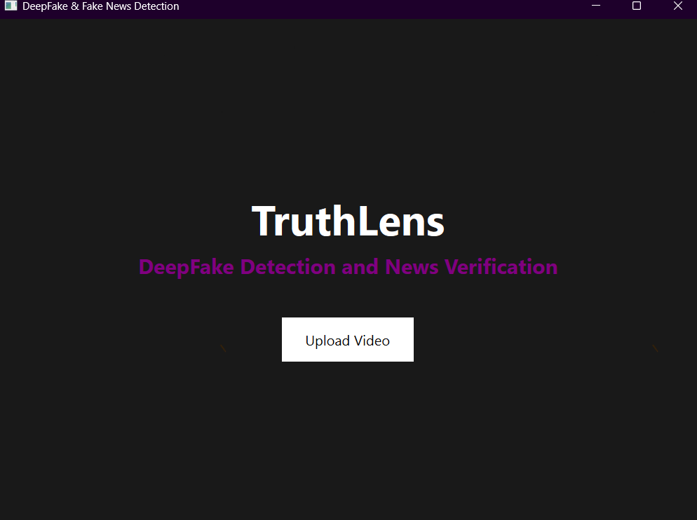
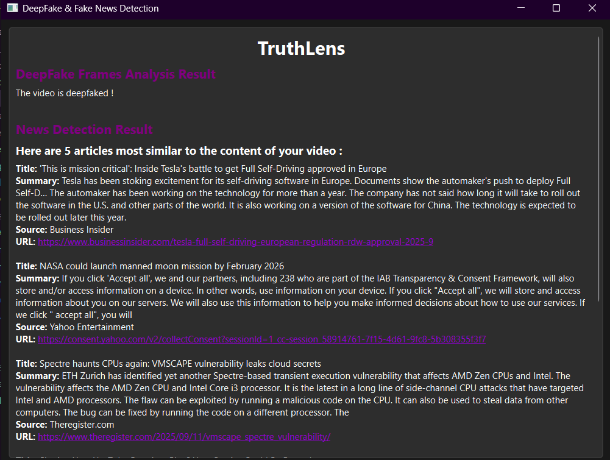
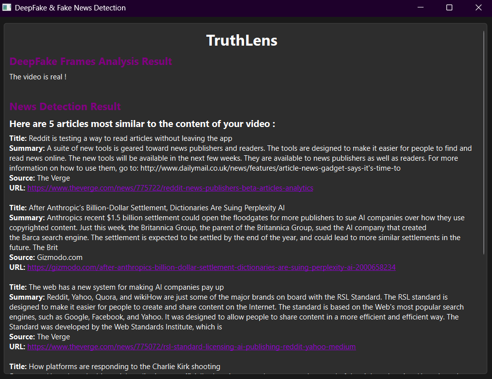

# TruthLens: DeepFake Detection & Fake News Verification

A comprehensive AI-powered application that analyzes video content to detect deepfake manipulations and verifies the authenticity of news by cross-referencing with credible sources.

<p align="center">
  
</p>

## 🎯 Project Overview

TruthLens is a desktop application built with PyQt6 that combines two powerful detection systems:

1. **DeepFake Detection**: Analyzes video frames to identify manipulated or synthetic media using deep learning
2. **Fake News Verification**: Transcribes video audio, extracts key information, and cross-references with real news articles to verify content authenticity

## 🚀 Features

### DeepFake Detection
- **Frame Extraction**: Extracts frames from uploaded videos at configurable intervals
- **Face Detection**: Uses MTCNN (Multi-task Cascaded Convolutional Networks) to detect and extract faces
- **Feature Extraction**: Employs ResNet50 pre-trained model to extract deep features from faces
- **LSTM Classification**: Analyzes temporal patterns across frames using LSTM neural networks
- **Real-time Results**: Provides instant feedback on whether the video is real or deepfaked

### Fake News Verification
- **Audio Transcription**: Converts video audio to text using OpenAI's Whisper model
- **Keyword Extraction**: Identifies key topics using KeyBERT
- **News Article Retrieval**: Fetches relevant articles from NewsAPI based on extracted keywords
- **Semantic Analysis**: Uses Sentence-BERT to compare video content with news articles
- **Source Verification**: Displays top 5 most similar articles with summaries and credible sources

### User Interface
- Clean, modern PyQt6-based GUI
- Two-screen workflow: upload and results
- Scrollable results display with clickable article links
- Professional styling with dark theme

## 📋 Requirements

### Python Version
- Python 3.8 or higher

### Dependencies

```
PyQt6>=6.4.0
opencv-python>=4.7.0
numpy>=1.24.0
mtcnn>=0.1.1
tensorflow==2.16.1
tf-keras
moviepy>=1.0.3
openai-whisper>=20230314
transformers>=4.28.0
keybert>=0.7.0
sentence-transformers>=2.2.0
requests>=2.28.0
torch>=2.0.0
torchvision>=0.15.0
numba==0.59.1
python-dotenv>=1.0.0
```

## 🔧 Installation

1. **Clone the repository**
```bash
git clone <repository-url>
cd "Interface DeepFake Detection & Fake News Verification"
```

2. **Create a virtual environment** (recommended)
```bash
python -m venv venv
source venv/bin/activate  # On Windows: venv\Scripts\activate
```

3. **Install dependencies**
```bash
pip install -r requirements.txt
```

4. **Download pre-trained model**
- Ensure `my_model.keras` is in the project root directory
- This is the trained LSTM model for deepfake detection

5. **Set up NewsAPI Key**
- Get a free API key from [NewsAPI.org](https://newsapi.org/)
- Create a `.env` file in the project root directory:
```bash
cp .env.example .env
```
- Edit the `.env` file and add your API key:
```
NEWSAPI_KEY=your_api_key_here
```

6. **Add background image**
- Ensure `black.png` is in the project root for the application background

## 🎮 Usage

1. **Run the application**
```bash
python main.py
```

2. **Upload a video**
   - Click "Upload Video" on the main screen
   - Select a video file (supported formats: .mp4, .avi, .mkv, .mov, .flv)

3. **View results**
   - **DeepFake Analysis**: See if the video is real or manipulated
   - **News Verification**: Review the top 5 most similar news articles with summaries and sources
   - Click on article URLs to verify information from credible sources

4. **Return to main screen**
   - Click "Main Screen" button to analyze another video

### Screenshots

<p align="center">
  <b>Example: DeepFake Detected</b>
</p>

<p align="center">
  
</p>

<p align="center">
  <b>Example: Real Video Detected</b>
</p>

<p align="center">
  
</p>

## 🏗️ Project Architecture

### File Structure
```
├── main.py                 # Application entry point
├── main_screen.py         # Landing page with video upload
├── second_screen.py       # Results display screen
├── DEEPFAKE.py           # DeepFake detection module
├── FAKENEWS.py           # Fake news verification module
├── my_model.keras        # Pre-trained LSTM model
├── black.png             # Background image
├── .env                  # Environment variables (API keys)
├── .env.example          # Example environment file
├── .gitignore            # Git ignore rules
├── requirements.txt      # Python dependencies
└── README.md             # This file
```

### Technical Pipeline

#### DeepFake Detection Pipeline
1. **Video Input** → Video upload through GUI
2. **Frame Extraction** → Extract frames at 15-frame intervals
3. **Face Detection** → MTCNN detects faces with highest confidence
4. **Feature Extraction** → ResNet50 extracts 2048-dimensional features
5. **Sequence Processing** → Features padded/truncated to 108 frames
6. **LSTM Classification** → Binary classification (Real/Fake)
7. **Result Display** → Show prediction with confidence

#### Fake News Verification Pipeline
1. **Video Input** → Same video from deepfake analysis
2. **Audio Extraction** → MoviePy extracts audio to MP3
3. **Speech-to-Text** → Whisper transcribes audio
4. **Keyword Extraction** → KeyBERT identifies top 5 keywords
5. **Article Retrieval** → NewsAPI fetches up to 50 relevant articles
6. **Text Summarization** → BART summarizes video content and articles
7. **Semantic Comparison** → Sentence-BERT computes cosine similarity
8. **Result Display** → Show top 5 most similar articles with sources

## 🧠 Machine Learning Models

### DeepFake Detection
- **Feature Extractor**: ResNet50 (pre-trained on ImageNet)
- **Classifier**: LSTM with 2 layers
  - Input: Sequence of 2048-dimensional features
  - Hidden units: 128 per layer
  - Output: Binary classification (Real/Fake)
- **Training Dataset**: Celeb-DF v2 dataset
- **Performance**: Optimized for temporal pattern recognition

### Fake News Verification
- **Speech Recognition**: Whisper Base model
- **Keyword Extraction**: KeyBERT with English stop words
- **Summarization**: BART Large CNN (Facebook)
- **Semantic Matching**: Sentence-BERT (all-MiniLM-L6-v2)
- **Similarity Metric**: Cosine similarity

## 🔍 How It Works

### DeepFake Detection
The system analyzes videos by:
1. Extracting faces from video frames using MTCNN
2. Generating deep features using ResNet50
3. Analyzing temporal patterns across frames with LSTM
4. Detecting inconsistencies typical of deepfake generation techniques

Key indicators of deepfakes include:
- Unnatural facial movements
- Temporal inconsistencies between frames
- Artifacts from GAN-based generation
- Blending artifacts around face boundaries

### Fake News Verification
The system verifies content by:
1. Converting video speech to text
2. Extracting key topics and entities
3. Searching credible news sources for similar content
4. Computing semantic similarity between video and articles
5. Presenting verified sources for fact-checking

## 🎓 Academic Context

This project was developed as part of a Pattern Recognition (Reconnaissance des Formes) course in Semester 7. It demonstrates practical applications of:
- Deep Learning for Computer Vision
- Natural Language Processing
- Sequence Modeling with RNNs/LSTMs
- Transfer Learning
- Feature Engineering
- Semantic Analysis

## ⚠️ Limitations

- **DeepFake Detection**:
  - Requires clear facial visibility
  - Performance depends on video quality
  - May struggle with heavily compressed videos
  - Limited to face-based deepfakes

- **Fake News Verification**:
  - Requires audible speech in video
  - Depends on NewsAPI availability and coverage
  - English language optimized
  - News article quality affects verification accuracy

## 🔮 Future Improvements

1. **Enhanced Detection**
   - Multi-modal analysis (audio + visual)
   - Support for full-body deepfakes
   - Real-time video stream analysis

2. **Improved Verification**
   - Multi-language support
   - Integration with multiple news APIs
   - Credibility scoring for sources
   - Fact-checking database integration

3. **User Experience**
   - Batch video processing
   - Export reports in PDF/JSON
   - Confidence score visualization
   - Historical analysis tracking

## 📝 License

This project is created for academic purposes. Please ensure proper attribution if using or modifying this code.

## 👥 Contributors

Developed as part of Pattern Recognition coursework at Euromed University of fez, Morocco.

---

**Disclaimer**: This tool is designed for educational and research purposes. While it provides valuable insights, results should be verified through multiple sources and critical thinking should always be applied when evaluating media content.